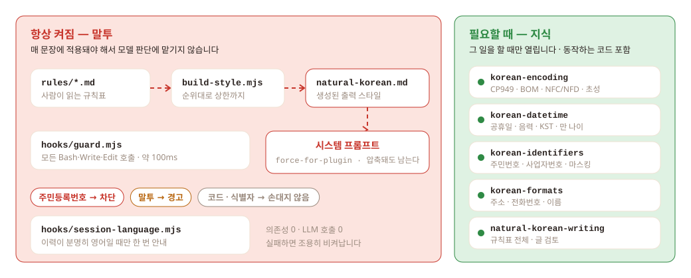

<div align="center">

<picture>
  <source media="(prefers-color-scheme: dark)" srcset="assets/logo-dark.svg">
  
</picture>

# kimchi-claude

**한국어로 물으면 한국 개발자가 실제로 쓰는 말투로 답합니다.**

<sub>항상 켜진 출력 스타일 · 산출물을 지키는 훅 · 필요할 때만 여는 한국 개발 지식 스킬 다섯 개</sub>

<br>


<br>

<picture>
  <source media="(prefers-color-scheme: dark)" srcset="assets/hero-dark.svg">
  
</picture>

<sub>두 답변은 지어낸 예가 아닙니다. <code>tests/fixtures/</code>에 보관한 실제 답변에서 발췌했고, 린터 점수도 <code>npm run score</code>로 낸 값 그대로입니다.</sub>

<br><br>

[고치는 것](#고치는-것) ·
[효과](#효과) ·
[동작 방식](#동작-방식) ·
[훅](#산출물을-지키는-훅) ·
[지식 스킬](#한국-개발-지식-스킬) ·
[설치](#설치) ·
[설정](#설정) ·
[용어 원칙](#용어를-고르는-원칙) ·
[기여](#기여)

</div>

<br>

<table>
<tr>
<td width="33%" valign="top">

### 🗣️ 항상 켜진 말투

출력 스타일이 **시스템 프롬프트**에 강제로 들어갑니다. 설치하면 바로 켜지고, 대화가 길어져
컨텍스트가 압축돼도 빠지지 않습니다.

</td>
<td width="33%" valign="top">

### 🧠 그대로인 작업 품질

판단, 분석, 코드, 도구 사용에는 손대지 않습니다. `keep-coding-instructions: true`로 둬서
클로드 코드의 기본 엔지니어링 지침도 그대로 남습니다.

</td>
<td width="33%" valign="top">

### 🛡️ 막을 것만 막는 훅

주민등록번호는 저장소에 들어가기 전에 **차단**하고, 말투는 알려만 줍니다. 문체 때문에 작업이
멈추면 그쪽이 더 큰 손해입니다.

</td>
</tr>
</table>

## 고치는 것

클로드 코드가 한국어로 답할 때 자주 나오는 어색함은 네 가지입니다. 두 문장은 고칠 부분만 다릅니다.

<!-- kimchi-ignore-start -->
| 유형 | 어색한 문장 | 고친 문장 |
|---|---|---|
| 🔤 직역 신조어 | 두 모듈 사이의 계약을 얇게 유지합니다 | 두 모듈 사이의 결합도를 낮게 유지합니다 |
| 🏢 판교어와 한영 혼용 | 이 컴포넌트의 state를 업데이트하고 디플로이합니다 | 이 컴포넌트의 상태를 갱신하고 배포합니다 |
| 📐 번역체 문장 구조 | 우리는 호출마다 캐시를 재생성합니다<br>당신의 코드에 경쟁 조건이 있습니다 | 호출마다 캐시를 재생성합니다<br>이 코드에 경쟁 조건이 있습니다 |
| 📝 공문서체와 끊긴 문장 | 쿠폰을 먼저 적용할지 여부를 정해야 합니다<br>캐시 키 누락. 수정 완료. | 쿠폰을 먼저 적용할지 정해야 합니다<br>캐시 키가 빠져 있어서 고쳤습니다. |
<!-- kimchi-ignore-end -->

앞의 두 가지는 원인이 서로 반대입니다. 직역 신조어는 영어를 지나치게 옮겨서, 판교어는 너무 덜
옮겨서 생깁니다. 그래서 "영어를 줄이라"는 처방도 "영어를 그대로 쓰라"는 처방도 맞지 않고,
**용어마다 정착된 표기를 정해 두는** 수밖에 없습니다.

> [!NOTE]
> **손대지 않는 것:** 코드, 식별자, 명령어, 파일 경로, 제품과 라이브러리 이름, 로그와 오류 메시지
> 원문, 소스 파일 내용, 코드 주석. 영어로 물으면 영어로 답하고, 규칙도 끼어들지 않습니다.

## 효과

같은 질문 4개를 출력 스타일 없이, kimchi-claude로, 그리고 다른 한국어 출력 스타일인
[fluent-korean](https://github.com/snflkd/fluent-korean)으로 받아 두 평가자가 조건을 가린 채 매겼습니다.

| 조건 | 점수 (1등 4점, 4등 1점) |
|---|---|
| kimchi-claude | 28 |
| kimchi-claude + fluent-korean 문법 규칙 | 26 |
| 스타일 없음 | 14 |
| fluent-korean | 12 |

판정 여덟 번 모두에서 kimchi-claude가 스타일 없음보다 위였습니다. 조건마다 한 번씩만 돌렸고 평가자가
Claude라는 한계가 있습니다. 답변 원문과 채점 방법은
[실험 기록](evals/experiments/2026-09-24-style-comparison/README.md)에 있습니다.

## 동작 방식

플러그인은 두 층으로 나뉘고, 두 층의 원칙이 정반대입니다.

<picture>
  <source media="(prefers-color-scheme: dark)" srcset="assets/layers-dark.svg">
  
</picture>

말투는 매 문장에 적용돼야 해서 모델이 부를지 말지 판단하게 둘 수 없습니다. 그래서 스킬이
아니라 시스템 프롬프트에 넣었습니다. 반대로 인코딩 지식은 인코딩을 다룰 때만 필요하니
스킬로 뒀습니다. 스킬이 평소에 차지하는 자리는 설명 몇 줄뿐이고, 글자 수는 아래 표 밑에 적혀 있습니다.

둘을 섞으면 출력 스타일의 6000자 상한을 곧바로 넘깁니다.

아래 숫자는 `npm run build`가 써 넣습니다. 손으로 고쳐도 다음 빌드에서 덮어씁니다.

<!-- kimchi:counts -->
| 갈래 | 개수 | 누가 막나 |
|---|---|---|
| 치환 | 445 | 린터가 잡고, `KIMCHI_AUTOFIX=1`이면 바로 고칩니다 |
| 정규식 | 134 | 린터가 잡아서 알려 줍니다 |
| 프롬프트 | 106 | 문자열로는 못 잡아서 출력 스타일로만 막습니다 |
| **합계** | **685** | 그중 47개가 출력 스타일 본문에 들어갑니다 |

스킬은 설명 5개, 모두 1531자만 늘 컨텍스트에 있습니다. 본문은 그 일을 할 때만 열립니다.
<!-- /kimchi:counts -->

<details>
<summary><b>출력 스타일 본문에 들어가는 규칙</b></summary>

<br>

본문은 분량 상한이 있어서 규칙을 다 담지 못합니다. 순위가 `핵심`인 규칙부터 담고, 두 종류에
예산을 따로 나눠 줍니다. 문장 구조처럼 미리 막는 방법밖에 없는 규칙, 그리고 용어처럼 린터도
잡을 수 있는 규칙입니다. **린터는 커밋 메시지와 문서 파일만 보고 대화는 보지 못합니다.** 그래서
용어 규칙도 본문에 있어야 대화에서 효과가 납니다.

순위가 같으면 짧은 규칙이 먼저 들어갑니다. 상한이 빠듯하면 긴 `핵심` 규칙이 빠지고 짧은
`보통` 규칙이 그 자리를 채울 수도 있습니다. 남는 자리를 비워 두지 않으려고 이렇게 정했습니다.

본문에 못 들어간 규칙은 린터가 잡거나(치환·정규식), 필요할 때 `natural-korean-writing` 스킬이
펼쳐 봅니다. "이 문서 말투 좀 다듬어줘"처럼 글 검토를 부탁하면 규칙표 전체를 엽니다. 어떤
규칙을 꼭 본문에 넣고 싶다면 `순위`를 `핵심`으로 올리면 됩니다.

</details>

<details>
<summary><b>스킬이나 슬래시 커맨드가 아니라 출력 스타일을 쓰는 이유</b></summary>

<br>

플러그인에 들어 있는 출력 스타일에 `force-for-plugin: true`를 달면 사용자가 고르지 않아도
적용됩니다. 스타일 본문은 대화 컨텍스트가 아니라 **시스템 프롬프트**에 들어가서 요청마다 다시
전송되고, 대화가 길어져 컨텍스트가 압축돼도 빠지지 않습니다.

스킬이나 슬래시 커맨드는 사람이든 모델이든 누군가 불러야 동작합니다. 말투는 매 문장에 적용돼야
하는 규칙이라 부를지 말지를 누구의 판단에도 맡길 수 없습니다.

</details>

## 산출물을 지키는 훅

대화는 출력 스타일이 맡고, **저장소에 남는 글**은 훅이 한 번 더 봅니다. 프로세스 하나가 세
가지를 판정하고, 차단과 경고가 함께 걸리면 차단이 우선합니다.

<picture>
  <source media="(prefers-color-scheme: dark)" srcset="assets/guard-dark.svg">
  
</picture>

<sub>그림 속 메시지는 훅에 합성 입력을 넣어서 받은 실제 출력입니다.</sub>

| | 대상 | 기본 동작 |
|---|---|---|
| 🔴 **개인정보** | 셸 명령과 사람이 쓰는 파일 (이미지·잠금 파일 같은 생성물은 뺍니다) | 주민등록번호로 보이는 값이 있으면 **막습니다.** 전각 숫자로 적어도 잡습니다 |
| 🟠 **말투** | 커밋 메시지, 한국어 문서 파일 | 고칠 표현과 이유를 **알려만 줍니다** |
| 🔵 **저장소 언어** | 세션 시작 | 커밋 이력이나 문서가 분명히 영어일 때만, 그 언어로 쓰라고 안내합니다 |

> [!IMPORTANT]
> 훅은 실패하면 아무것도 출력하지 않고 조용히 빠집니다. 검사 하나를 놓치는 것보다 훅이 깨져서
> 작업을 막는 쪽이 훨씬 나쁘기 때문입니다. 도구를 호출할 때마다 돌기 때문에 한 번에 80ms 안팎으로
> 끝나게 유지합니다.

### 저장소의 산출물 언어

오픈소스에 기여할 때는 대화는 한국어로 하더라도 커밋 메시지는 영어로 써야 합니다. 이
플러그인은 어느 쪽인지를 **설정 없이 알아냅니다.**

설정 파일을 만들라고 하지 않습니다. 어차피 아무도 만들지 않고, 답은 이미 저장소에 있습니다.
커밋 이력과 README를 보면 이 팀이 어느 언어로 쓰는지 알 수 있습니다.

| 판정 | 근거 | 동작 |
|---|---|---|
| 🇺🇸 영어 | 최근 커밋 제목 40개 중 한글이 든 제목이 10% 이하 | 커밋과 PR은 영어로 쓰라고 알려 줍니다 |
| 🇰🇷 한국어 | 60% 이상 | 따로 알리지 않습니다. 출력 스타일이 이미 한국어로 쓰게 합니다 |
| 🤷 혼용·알 수 없음 | 그 사이이거나 표본이 3개 미만 | **끼어들지 않습니다** |

두 문턱 모두 보수적으로 잡았습니다. 어느 쪽으로 틀리느냐에 따라 치르는 값이 다르기 때문입니다. 아무 말도
안 하는 실수는 손해가 작지만, 영어로 쓰라고 잘못 시키면 팀 관행을 거스르게 됩니다.

문서는 글자 비율로 판정합니다. 긴 영어 README에 한국어 한 줄이 섞여 있으면 영어 문서로 보고,
두 언어가 반씩 섞여 있으면 끼어들지 않습니다. 코드 블록은 판정에서 뺍니다.

사용자가 한국어로 쓰라고 하면 판정보다 그 말을 따릅니다.

## 한국 개발 지식 스킬

한국 서비스를 만들 때 클로드가 번번이 틀리는 것들을 미리 알려 둡니다. **설명의 절반은 직접
구현하지 말라고 말리는 내용입니다.**

| 스킬 | 가장 쓸모 있는 내용 |
|---|---|
| 🪪 `korean-identifiers` | 주민등록번호는 2020년 10월부터 뒷자리를 임의로 발급해서 **체크섬 검증이 통하지 않습니다.** 검증 코드를 넣으면 정상 번호를 거부합니다 |
| 📅 `korean-datetime` | 음력 공휴일을 직접 계산하면 반드시 틀립니다. 공공데이터포털에서 받아 씁니다. 설·추석 연휴는 토요일과 겹쳐도 대체공휴일이 생기지 않습니다 |
| 🔠 `korean-encoding` | macOS에서 올린 파일 이름은 NFD라서 서버의 NFC와 다릅니다. 눈으로는 구별이 안 됩니다 |
| 📞 `korean-formats` | 전화번호를 고정 자릿수로 검증하면 서울 번호(02)와 대표번호(1588)를 거부합니다 |
| ✍️ `natural-korean-writing` | 규칙표 전체입니다. "이 문서 말투 좀 다듬어줘"처럼 글 검토를 부탁할 때 펼칩니다 |

스킬마다 **실제로 돌아가는 코드**가 들어 있습니다. 설명만 있으면 클로드가 코드를 새로 짜다가
또 틀립니다. `skills/*/examples/*.mjs`는 `npm test`가 검증합니다.

## 설치

클로드 코드에서 아래 두 명령을 **한 줄씩 따로** 입력합니다. 두 줄을 한꺼번에 붙여 넣으면 한 명령으로
합쳐져서 "not a valid GitHub owner/repo shorthand" 오류가 납니다.

1. 마켓플레이스를 추가합니다.

   ```text
   /plugin marketplace add SungJun1217/kimchi-claude
   ```

2. 플러그인을 설치합니다.

   ```text
   /plugin install kimchi-claude@kimchi-claude-marketplace
   ```

켜면 바로 적용됩니다. 출력 스타일을 따로 고를 필요는 없습니다.

<details>
<summary>저장소를 직접 받아서 쓸 때</summary>

<br>

```bash
git clone https://github.com/SungJun1217/kimchi-claude.git
claude --plugin-dir ./kimchi-claude
```

</details>

> [!WARNING]
> 이 플러그인은 출력 스타일을 **강제로 적용**합니다. 켜 둔 동안에는 Concise나 Explanatory 같은
> 다른 스타일을 고를 수 없습니다. 설치만으로 켜지게 하는 방법이 이것뿐이라 이렇게 했습니다. 다른
> 스타일이 필요하면 잠시 플러그인을 꺼 두면 됩니다.

## 설정

설정은 모두 환경변수로 하고, 기본값은 가장 조용한 쪽입니다.

| 환경변수 | 기본값 | 동작 |
|---|---|---|
| `KIMCHI_DISABLE=1` | 꺼짐 | 훅을 모두 끕니다 |
| `KIMCHI_AUTOFIX=1` | 꺼짐 | 커밋 메시지와 문서의 표기 오류를 자동으로 고칩니다 |
| `KIMCHI_BLOCK=1` | 꺼짐 | 말투 위반이 있으면 커밋과 문서 쓰기를 막습니다 |
| `KIMCHI_PII=warn` | 차단 | 주민등록번호를 찾아도 막지 않고 알려만 줍니다 |
| `KIMCHI_PII=off` | 차단 | 주민등록번호 검사를 끕니다 |
| `KIMCHI_REPO_LANG=off` | 켜짐 | 저장소 산출물 언어 판정을 끕니다 |

`KIMCHI_BLOCK`을 기본으로 꺼 둔 이유가 있습니다. 문체 때문에 작업을 끊으면 재시도하느라 턴을
낭비하고, 심하면 클로드가 원래 하던 일을 잊어버립니다. 말투가 작업을 방해하면 본말이 뒤바뀐
셈입니다.

## 용어를 고르는 원칙

용어는 이 순서로 고릅니다.

1. **한국어 기술 용어가 있으면 그 용어를 씁니다.** 대개 한자어입니다. 결합도, 의존성, 응집도,
   불변식, 멱등, 영향 범위, 책임, 경쟁 조건, 교착 상태, 처리량, 지연 시간, 부수 효과, 하위 호환.
2. **정착된 외래어가 있으면 외래어를 씁니다.** 캐시, 커밋, 머지, 브랜치, 배포, 인터페이스,
   리팩터링, 스레드.
3. **둘 다 없으면 원어를 그대로 씁니다.**
4. **순우리말로 풀어 쓰는 건 마지막 수단입니다.**
5. **은유는 번역하지 않습니다.**

가장 자주 어긋나는 건 4번입니다. "자연스러운 한국어"가 순우리말이라는 뜻은 아닙니다. 한국어
기술 문서는 실제로 한자어를 많이 쓰고, 한자어가 더 짧고 정확합니다.

같은 원문을 두고 두 방향으로 틀릴 수 있습니다.

<!-- kimchi-ignore-start -->
| 원문 | ❌ 틀린 답 1 (직역) | ❌ 틀린 답 2 (풀어쓰기) | ✅ 맞는 답 |
|---|---|---|---|
| thin contract | 얇은 계약 | 모듈끼리 서로 알아야 하는 것을 최소로 줄이세요 | 결합도를 낮추세요 |
| blast radius | 블라스트 레디우스 | 여파가 미치는 범위 | 영향 범위 |
<!-- kimchi-ignore-end -->

설계 판단과 근거는 [설계 문서](docs/design.md)에
정리해 뒀습니다.

## 기여

규칙을 더하거나 고치는 방법, 개발 명령은 [CONTRIBUTING.md](CONTRIBUTING.md)에 정리해 뒀습니다.
의존성이 없어서 Node만 있으면 `npm test`로 바로 시험을 돌릴 수 있습니다.

<div align="center">
<br>
<sub>🌶️ 잘 익은 말투는 티가 나지 않습니다.</sub>
</div>
